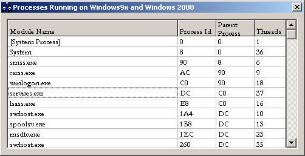



## System Running Process

### Description

This code shows u, the current running process of u r system. Its very fast and effieient.
 
### More Info
 

             |
---                |---
**Submitted On**   |2004-11-25 06:55:02
**By**             |[Anuj sharrma](https://github.com/Planet-Source-Code/PSCIndex/blob/master/ByAuthor/anuj-sharrma.md)
**Level**          |Beginner
**User Rating**    |4.5 (18 globes from 4 users)
**Compatibility**  |VB 6\.0
**Category**       |[Windows CE](https://github.com/Planet-Source-Code/PSCIndex/blob/master/ByCategory/windows-ce__1-41.md)
**World**          |[Visual Basic](https://github.com/Planet-Source-Code/PSCIndex/blob/master/ByWorld/visual-basic.md)
**Archive File**   |[System\_Run18218111252004\.zip](https://github.com/Planet-Source-Code/anuj-sharrma-system-running-process__1-57414/archive/master.zip)

